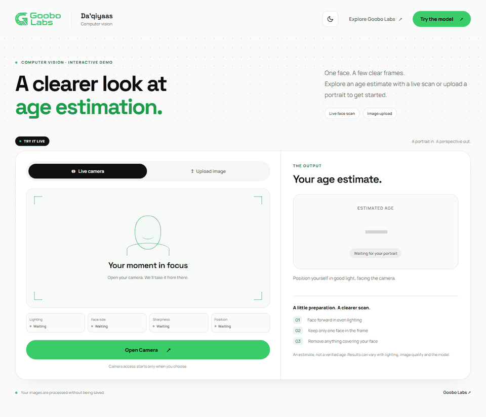
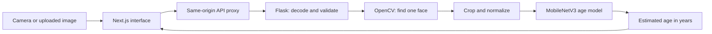

<p align="center">
  <a href="https://www.goobolabs.so/en"></a>
</p>

<h1 align="center">Da’qiyaas</h1>

<p align="center">Age estimation from a portrait or a short face scan.</p>
<p align="center"><strong>Next.js 15 · Flask · PyTorch · UTKFace</strong></p>

<p align="center">
  <a href="#demo">Demo</a> ·
  <a href="#run-locally">Run locally</a> ·
  <a href="#how-it-works">How it works</a> ·
  <a href="#training">Training</a> ·
  <a href="#results">Results</a> ·
  <a href="#tests">Tests</a>
</p>

Da’qiyaas finds a face in an image and estimates its age. You can upload a portrait or open the camera for an automatic scan. The camera waits for a clear, steady face, collects five estimates, displays their median, and stops. The interface follows the Goobo Labs brand and supports light and dark themes.

**The output is an estimate, not a verified age.** The current model has a test mean absolute error (MAE) of **5.72 years** on full portraits and **6.13 years** on detected-face crops from this project's UTKFace test split. Its accuracy on physical-webcam images has not been measured.

## Demo



*Recorded from the running app with the real Flask API and trained model. The project owner's supplied portrait is uploaded, then supplied through a virtual camera. API results are not mocked. This demonstrates the workflow; it does not measure webcam accuracy. The displayed ages are model estimates; the portrait has no verified age label in this demo.*

[View the light interface](docs/assets/overview.png) · [View the dark result](docs/assets/dark-result.png) · [Recording details](docs/assets/demo-recording.json)

## What you can do

| Feature | Behavior |
| --- | --- |
| Live camera | Start a scan with **Open Camera**; no capture button is needed. |
| Face scan | A box follows the detected face and shows scan progress. |
| Capture guidance | Lighting, Face size, Sharpness and Position indicators explain what needs attention. |
| Image upload | Choose a JPG, PNG or WebP portrait with one face. |
| Stable result | The camera stops after a completed estimate. **Try Again** starts a fresh scan. |
| Theme switch | The sun/moon button switches themes and saves your preference. |
| Mobile layout | Camera controls and results stack vertically on narrow screens. |

## Run locally

### Requirements

The tested environment uses **Python 3.14**, **Node.js 24** and Windows PowerShell. Training and inference run on CPU; an NVIDIA GPU is not required. Browser tests use Microsoft Edge. Other environments have not been verified.

In the prepared workspace, dependencies and the trained model already exist. Skip installation and start the two services below. For a fresh checkout, install dependencies first:

```powershell
# Run from the project root.
python -m venv .venv
.\.venv\Scripts\python.exe -m pip install -r requirements.txt
npm.cmd --prefix frontend ci
```

Dataset images, generated feature caches and model weights are excluded from Git. A fresh checkout needs the UTKFace images and the [training steps](#training), or a compatible trained checkpoint placed at `models/age_model.pt`.

### Start the services

Open two terminals at the project root.

**Terminal 1 — Flask and the model**

```powershell
.\.venv\Scripts\python.exe -m backend.app
```

**Terminal 2 — Next.js**

```powershell
npm.cmd --prefix frontend run dev
```

Open **[http://127.0.0.1:3000](http://127.0.0.1:3000)**. Flask listens on `127.0.0.1:5000`. Both services bind to the local computer. Press **Ctrl+C** in each terminal to stop them.

The convenience scripts `start-backend.ps1` and `start-frontend.ps1` run the same services. To serve a production frontend build locally:

```powershell
npm.cmd --prefix frontend run build
npm.cmd --prefix frontend run start
```

Stop the development frontend before starting the production server on the same port. Flask must remain running.

### Configuration

| Setting | Default | Purpose |
| --- | --- | --- |
| `BACKEND_URL` | `http://127.0.0.1:5000` | Server-side destination for Next.js API requests. |
| Model checkpoint | `models/age_model.pt` | Loaded by Flask once at startup. |
| Browser theme | Saved preference, then system theme | Only the explicit theme choice is stored locally. |

For a different backend address, copy [frontend/.env.example](frontend/.env.example) to `frontend/.env.local`, change `BACKEND_URL`, and restart Next.js. Rebuild if using the production server. Restart Flask whenever you replace its model checkpoint.

## How it works



Next.js handles camera access, uploads, preview images, scan state and results. Its `/api/*` proxy forwards requests to Flask, so the browser uses one origin. Flask reads the image, checks its format and dimensions, detects a face, prepares a face crop, and runs the model in inference mode.

The model receives a **160 × 160 RGB** face image normalized with ImageNet mean and standard deviation. Its regression head returns one number in years. The API bounds that number to 0–120; the interface rounds it for display. It does not identify the person or look up a date of birth.

### Camera flow

1. **Permission and warm-up.** The user opens the camera. After permission, the app waits 1.5 seconds for initial exposure and focus.
2. **Scan.** Frames go to `/api/scan`. The server looks for exactly one face and checks face size, light and sharpness. The response includes the face box, which is drawn over the mirrored preview.
3. **Stability.** Three consecutive stable face boxes are required before age prediction begins. Movement, face loss, multiple faces or poor capture quality reset the scan.
4. **Estimate.** Five clear frames go through the same age model used for uploads. If their estimates span more than eight years, scanning restarts. Otherwise the app displays their median.
5. **Stop.** Camera tracks are released after success. **Try Again**, **Cancel** and switching input modes clear the previous scan state. Late responses from cancelled attempts are ignored.

Only one camera request is in flight at a time. Clear frames are sampled after 450 ms; recoverable capture errors retry after 650 ms. Each request has a 30-second timeout.

<details>
<summary><strong>Capture checks and thresholds</strong></summary>

| Check | Current rule |
| --- | --- |
| Face size | At least 100 pixels on each side, and at least 16% of the frame's width and height. |
| Lighting | Mean face grayscale between 45 and 220. |
| Sharpness | Laplacian variance at least 35 after resizing the grayscale face to 160 × 160. |
| Position | Face-center movement under 4% of each frame dimension and face-size change under 20% between checks. |

These are capture heuristics, not calibrated confidence scores. A green indicator means the frame passed a check; it does not mean the age estimate is correct. See [backend/app.py](backend/app.py) and [camera-scan.ts](frontend/app/camera-scan.ts).

</details>

### Upload flow

An uploaded image uses the same face detector, crop, normalization and age model. It produces one estimate rather than a multi-frame median. Camera-only quality gates do not apply to uploads. The browser accepts JPG, PNG and WebP files up to **8 MiB**; the backend also checks the actual image format and limits decoded images to **16 million pixels**.

### Image handling

The application keeps uploads in bounded memory and does not save them, create prediction history or add them to training. Browser preview URLs are released when replaced or cleared. There is no account system or database. The README demo is a deliberate recording of a dataset fixture, saved separately in `docs/assets/`.

## Training

### Dataset preparation

Place extracted UTKFace JPGs in `data/UTKFace/`. The age must be the numeric prefix of each filename, such as `24_...jpg`. Preparation reads the source images without changing them.

| Audit item | Count |
| --- | ---: |
| Source JPGs | 23,708 |
| Images that could not be decoded | 0 |
| Extra exact-pixel duplicate copies | 390 |
| Groups with contradictory age labels | 205 |
| Unique usable images after exclusions | 23,113 |
| Training / validation / test | 16,176 / 3,467 / 3,470 |

The audit hashes decoded RGB pixels, removes duplicate copies and excludes whole groups with conflicting ages. It then splits by ten-year age bands using seed **42**, targeting 70% training, 15% validation and 15% test. All counts are recorded in [the dataset summary](docs/dataset-summary.json).

Exact duplicates cannot cross these splits. Near duplicates and photos of the same person may still cross them because reliable identity IDs are unavailable.

### Train the baseline, then fine-tune

Run these commands from the project root:

```powershell
.\.venv\Scripts\python.exe -m ml.prepare
.\.venv\Scripts\python.exe -m ml.train --benchmark
.\.venv\Scripts\python.exe -m ml.train
.\.venv\Scripts\python.exe -m ml.finetune
.\.venv\Scripts\python.exe -m ml.improve --epochs 6
```

**Baseline.** MobileNetV3 Small starts with torchvision ImageNet weights. Its frozen backbone produces 576 features per portrait, cached locally. A `576 → 128 → 1` head learns to predict age. Training uses Smooth L1 loss and AdamW; validation MAE selects the checkpoint, with early stopping after ten epochs without improvement.

**Fine-tuning.** The final feature blocks and regression head train for three more epochs. Early filters and batch-normalization statistics stay frozen. Training images receive mild horizontal flips, affine changes, lighting/color variation and occasional blur. Validation selects the candidate; promotion requires at least a **0.1-year** MAE improvement over the preserved baseline. Test evaluation happens after that decision.

**Crop-aware improvement.** `ml.improve` starts from the active checkpoint and preserves it in a timestamped `models/improvement-*/` folder. It mixes full portraits with the same face crops used by Flask, samples underrepresented age decades more often, and trains feature blocks 6 onward with a cosine learning-rate schedule. Validation is measured on both full portraits and detected-face crops. Promotion requires a crop MAE improvement of at least 0.1 years, no overall full-portrait regression, and no age-band regression greater than one year on either view. The test split is loaded only after checkpoint selection.

The first baseline run downloads pretrained weights. Feature caches are reused when the manifest fingerprint and image size match. If you change backbone weights or preprocessing code, remove the generated `data/processed/*-features.pt` caches before rerunning baseline training. Fine-tuning does not use those caches.

| Output | Contents |
| --- | --- |
| `data/processed/` | Audit, split manifests, benchmark and feature caches. |
| `models/age_model.pt` | Active checkpoint used by Flask. |
| `models/baseline/` | Baseline checkpoint and report preserved by the first fine-tuning run. |
| `models/candidate.pt` | Candidate selected during fine-tuning. |
| `models/evaluation.json` | Active model metrics. |
| `models/finetune-report.json` | Initial fine-tuning comparison, epoch results and promotion decision. |
| `models/improvement-report.json` | Crop-aware validation, detector coverage counts and selected-checkpoint test results. |
| `models/improvement-*/` | Previous active weights/report, progress and selected candidate for each improvement run. |

Re-running baseline training replaces the active checkpoint. The preserved baseline folder is created only once; keep track of it if you later change datasets or training settings.

## Results

MAE is the average absolute difference between predicted and labeled age. Lower is better. It is not an accuracy percentage or a guarantee for any individual prediction.

| Model / input | Validation MAE | Test MAE |
| --- | ---: | ---: |
| Frozen-backbone baseline, full portrait | 7.78 years | 7.70 years |
| Initial partial fine-tuning, full portrait | 6.96 years | 6.72 years |
| Crop-aware fine-tuning, active, full portrait | **5.91 years** | **5.72 years** |
| Previous model, detected-face crop | 7.36 years | 7.08 years |
| Crop-aware fine-tuning, active, detected-face crop | **6.11 years** | **6.13 years** |

The full test set contains **3,470 images**. The detector found exactly one face in **1,914** of them; crop scores cover only that subset. Crop test MAE improved by **13.4%**. Epoch 6 was selected using validation scores before test evaluation.

| Labeled age | Full test images | Active full-portrait MAE | Active crop MAE |
| --- | ---: | ---: | ---: |
| 0-12 | 508 | 3.43 | 5.72 |
| 13-19 | 169 | 6.12 | 5.40 |
| 20-39 | 1,736 | 4.64 | 4.66 |
| 40-59 | 665 | 7.52 | 7.78 |
| 60-79 | 293 | 9.94 | 11.37 |
| 80-120 | 99 | 11.11 | 17.12 |

All MAEs above are in years. Older groups remain less accurate. Full and crop columns cover different subsets. Complete active metrics are in [model-evaluation.json](docs/model-evaluation.json), the latest comparison is in [model-improvement.json](docs/model-improvement.json), and the initial fine-tuning comparison remains in [model-comparison.json](docs/model-comparison.json).

Crop-aware training and evaluation took about **2,090 seconds**. The active model averaged **17.59 ms** for a single forward pass over 20 warmed CPU runs. This excludes decoding, face detection, request handling and the multi-frame scan; it is not end-to-end camera latency.

### What these results do not establish

- No labeled physical-webcam dataset was supplied. Camera-like augmentation and a virtual-camera demo do not establish real-webcam accuracy.
- The test split was already evaluated for the baseline. It is not a newly collected external holdout.
- UTKFace portraits are already cropped; camera crops, angles and lighting can differ.
- Haar face detection can miss difficult poses and occlusions.
- Filename labels were parsed and contradictions checked, but the underlying ages were not independently verified.

## API

All browser requests use the Next.js proxy. The same routes are available directly on Flask at port 5000.

| Method | Route | Purpose |
| --- | --- | --- |
| `GET` | `/api/health` | Model readiness: 200 when ready, otherwise 503. |
| `POST` | `/api/scan` | Check one camera frame; return its face box and quality states without an age. |
| `POST` | `/api/predict` | Estimate age from an image. Add form field `source=camera` for camera quality gates and metadata. |

Both POST routes require multipart field `image`. Face-box coordinates are normalized to the processed image dimensions. Errors contain `error.code` and `error.message`; scan quality errors may also contain a face box and quality states.

```powershell
curl.exe -F "image=@portrait.jpg" http://127.0.0.1:5000/api/predict
```

Example response shape; the number is illustrative:

```json
{
  "estimated_age": 28.4,
  "unit": "years",
  "is_estimate": true
}
```

Common codes include `MISSING_IMAGE`, `INVALID_IMAGE`, `IMAGE_TOO_LARGE`, `NO_FACE`, `MULTIPLE_FACES`, `FACE_TOO_SMALL`, `LOW_LIGHT`, `OVEREXPOSED`, `BLURRY_FACE`, `MODEL_NOT_READY` and `INFERENCE_FAILED`. Responses use `Cache-Control: no-store`.

## Tests

From the project root:

```powershell
.\.venv\Scripts\python.exe -m pytest backend/tests -q
npm.cmd --prefix frontend run build
```

With Flask running, run the browser suite from `frontend/`:

```powershell
cd frontend
$env:RUN_INTEGRATION = '1'
npm.cmd test
```

The browser tests start or reuse the production frontend. Build it first. Without `RUN_INTEGRATION=1`, the real-model integration test is skipped. Tests that need a trained checkpoint are also skipped if it is absent.

The documentation refresh was checked against **27 passing backend tests** and **15 passing browser tests**. Coverage includes input validation, quality gates, real-model loading, face detection, scan completion, cancellation, retry, stale responses, upload, theme persistence and mobile overflow.

Most camera UI tests use synthetic streams and mocked API responses so state transitions can be checked deterministically. The integration test and the README recording use the real backend and model. A physical-webcam check remains a separate manual task.

### Record the GIF again

Keep both local services running, then run:

```powershell
# From the project root:
node frontend/scripts/record-demo.cjs --image "C:\path\to\portrait.jpg"
.\.venv\Scripts\python.exe scripts/encode_demo.py
```

The recording script uses headless Edge, uses the supplied portrait, exercises upload and a virtual-camera scan, and asserts that the camera stops after success. PNG frames go to `.run/demo-frames/`; Pillow encodes them into `docs/assets/demo.gif` using their recorded timing. No extra video encoder is required. Omitting --image falls back to a valid adult UTKFace test portrait.

## Project map

```text
age-prediction-system/
├── frontend/
│   ├── app/                 Interface, scan state, quality indicators and theme
│   ├── public/brand/        Local Goobo Labs logo and fonts
│   ├── scripts/             Browser demo recorder
│   └── tests/               Playwright flows and real-model integration
├── backend/
│   ├── app.py               Flask API, decoding, detection and inference
│   └── tests/               API, capture quality and checkpoint tests
├── ml/
│   ├── prepare.py           Image audit and reproducible splits
│   ├── model.py             Architecture, preprocessing and checkpoint loading
│   ├── train.py             Frozen-backbone baseline and CPU benchmark
│   └── finetune.py          Candidate training, selection and promotion
├── data/                    Local dataset, manifests and caches; ignored by Git
├── models/                  Local weights and training reports; ignored by Git
├── docs/                    GIF, screenshots and portable result snapshots
├── scripts/encode_demo.py   Browser frames to GIF
├── specs/                   Requirements, design decisions, tasks and verification
└── requirements.txt         Pinned Python dependencies
```

## Troubleshooting

| Problem | Check |
| --- | --- |
| Camera is unavailable | Use localhost or HTTPS and allow camera permission in the browser. |
| Scan keeps restarting | Face forward, improve lighting, move closer and hold still. Indicators explain failed checks. |
| No face or multiple faces | Use one clear, front-facing portrait. |
| Model is not ready | Train or restore `models/age_model.pt`, then restart Flask. |
| Upload request fails | Check Flask is running, `/api/health` is ready, and the image meets size/format limits. |
| Port already in use | Stop the existing instance before starting another on port 3000 or 5000. |
| Old UI remains visible | Restart the frontend after a rebuild and refresh the browser with Ctrl+Shift+R. |
| Browser tests cannot launch | Check Microsoft Edge is installed; the Playwright config uses the `msedge` channel. |

## Spoken results

Select **Sound off** to enable Somali speech before scanning or uploading. Once the final estimate is ready, the app says “Da’daada waxaa lagu qiyaasay 24 sano.” The number matches the displayed estimate. **Listen again** replays it; **Stop audio**, muting, a new image or a mode change cancels playback. The sound preference is saved in this browser and defaults to off.

The app first looks for a Somali voice on the device. Available voices depend on the browser and operating system ([Web Speech documentation](https://developer.mozilla.org/en-US/docs/Web/API/SpeechSynthesis/getVoices)). If none is available, it requests audio from the backend. An unavailable or blocked voice leaves the visual estimate usable.

For devices without a Somali voice, configure [Azure Speech](https://learn.microsoft.com/en-us/azure/ai-services/speech-service/language-support) with the `so-SO-UbaxNeural` voice. In a PowerShell terminal at the project root, set the resource region and enter the key privately, then start the backend from that same terminal:

```powershell
$env:AZURE_SPEECH_REGION = 'eastus' # Use your resource's region
$speechSecret = Read-Host 'Azure Speech key' -AsSecureString
$env:AZURE_SPEECH_KEY = [System.Net.NetworkCredential]::new('', $speechSecret).Password
.\start-backend.ps1
```

Restart an already running backend after configuring credentials. Keep the key out of frontend variables and Git. No Azure account or paid resource is created by this project. Choose the Azure pricing tier explicitly in your account.

`GET /api/speech` reports server availability; `POST /api/speech` accepts only an integer `age` from 0 to 120 and returns MP3 audio. The server generates a fixed sentence and sends only that text to Azure, never a portrait. Clips are cached in memory by age until the backend restarts. Requests time out and speech errors do not change the prediction. The browser may require **Listen again** before allowing playback.

Voice orchestration is tested with simulated browser voices and provider responses. Azure audio quality and Somali pronunciation still need a listening check with configured credentials.

## License

Da’qiyaas source code is licensed under the [MIT License](LICENSE), copyright © 2026 Goobo Labs.

[UTKFace](https://github.com/aicip/UTKFace) is available for **non-commercial research purposes only** and is subject to its own terms. The MIT license does not relicense the dataset or grant commercial-use permission for the trained model. Dataset images and model weights are excluded from this repository.

Third-party dependencies, fonts and brand assets retain their respective licenses and ownership. The portrait shown in the demo is not covered by the source code license.


